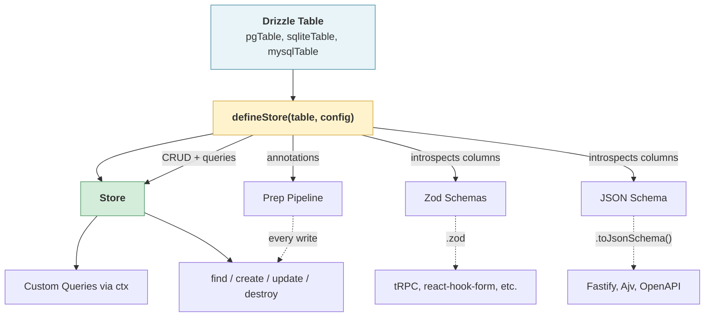

# Storium

A lightweight, database-agnostic storage toolkit built on [Drizzle](https://orm.drizzle.team) and [Zod](https://zod.dev/).

I built Storium because Drizzle gives you a fantastic query builder, but every project still needs the same scaffolding on top of it: validation, sanitization, CRUD operations, migration workflows, and some coherent pattern tying it all together. I kept rebuilding that scaffolding. Poorly, at first. Then well enough that I stopped wanting to rewrite it, which felt like a milestone worth shipping.

Define your tables with native Drizzle, then wrap them with `defineStore()` to layer on column annotations, validation, transforms, and a full CRUD repository. Storium generates Zod schemas and JSON Schema from Drizzle's column metadata — one source of truth, every layer covered. No more redeclaring the same shape in three different formats and hoping they don't drift apart over time.

The goal is a data-access layer that's structured enough to keep things consistent and predictable, but flexible enough that you're never fighting it. You define the stores, the queries, the transforms. Storium just makes it harder to stray from the pattern -- especially six months in when the codebase would have otherwise quietly rotted into three different ways of talking to the database.

## Quick Start

```bash
npm install storium

# Plus your database driver:
npm install pg             # PostgreSQL
npm install mysql2         # MySQL
npm install better-sqlite3 # SQLite
```

```typescript
import { pgTable, uuid, varchar } from 'drizzle-orm/pg-core'
import { storium, defineStore } from 'storium'

// 1. Define a native Drizzle table
const usersTable = pgTable('users', {
  id: uuid('id').primaryKey().defaultRandom(),
  email: varchar('email', { length: 255 }).notNull(),
  name: varchar('name', { length: 255 }),
})

// 2. Connect and create a store
const db = storium.connect({
  dialect: 'postgresql',
  url: process.env.DATABASE_URL,
})

const users = db.defineStore(usersTable, {
  columns: { email: { required: true } },
})

const user = await users.create({ email: 'alice@example.com', name: 'Alice' })
const found = await users.findById(user.id)
const updated = await users.update(user.id, { name: 'Alice B.' })
```

## Features

- **Single source of truth** — Drizzle column metadata drives Zod schemas, JSON Schema, and the prep pipeline automatically
- **Repository pattern** — default CRUD with extensible custom queries
- **Three-tier validation** — JSON Schema for the HTTP edge, Zod for runtime, prep pipeline for business rules
- **Database agnostic** — PostgreSQL, MySQL, and SQLite via Drizzle
- **Composable mixins** — `belongsTo`, `hasMany`, `hasOne`, `withMembers`, `withPagination`, `withCache`, `transaction`
- **Soft delete** — built-in via `softDelete: true` in store config
- **Fastify integration** — `toJsonSchema()` for route validation
- **Migration tooling** — thin CLI wrapping drizzle-kit
- **Stands back** — Storium doesn't try to own your architecture. It gives you tools and gets out of the way.

## How It Fits Together



## Core Concepts

### Column Annotations

Columns are defined with native Drizzle — types, defaults, constraints, indexes are all Drizzle's domain. Storium adds a thin annotation layer on top for access control and validation:

```typescript
const userStore = defineStore(usersTable, {
  columns: {
    email:     { required: true, validate: (v, test) => test(v, 'is_email') },
    password:  { hidden: true, transform: hashPassword },
    createdAt: { readonly: true },
    updatedAt: { readonly: true },
  },
})
```

| Annotation | Effect |
|------------|--------|
| `readonly` | Excluded from create and update operations |
| `hidden` | Excluded from SELECT results (still writable) |
| `required` | Must be provided on create |
| `transform` | Runs before validation — sanitization, hashing, enrichment |
| `validate` | Custom validation using the `test()` API |

### Custom Queries

This is where Storium really earns its keep. Custom queries receive `ctx` with the database handle and all default CRUD operations. You can override defaults by name. `ctx` always has the originals, so you can compose on top of them rather than starting from scratch:

```typescript
const users = db.defineStore(usersTable, { columns }).queries({
  // Override create — hash password before insert
  create: (ctx) => async (input, opts) => {
    const hashed = { ...input, password: await hash(input.password) }
    return ctx.create(hashed, { ...opts, skipPrep: true })
  },

  // New query — just write Drizzle like you normally would
  findByEmail: (ctx) => async (email) =>
    ctx.drizzle.select(ctx.selectColumns)
      .from(ctx.table)
      .where(eq(ctx.table.email, email))
      .then(r => r[0] ?? null),
})
```

The pattern is always the same: `(ctx) => async (...yourArgs) => result`. Storium gives you the tools via `ctx`, you decide what to do with them.

### Validation Schemas

Every store generates runtime validation schemas that you can use however you like. I find this especially handy for keeping validation consistent between my API layer and my business logic without duplicating definitions (and trying to keep them all in sync):

```typescript
// Optionally destructure schemas from store
const { createSchema } = users.schemas

// Validate input (throws ValidationError)
createSchema.validate(data)

// Try without throwing
const result = createSchema.tryValidate(data)

// JSON Schema (e.g., as used by Fastify)
app.post('/users', {
  schema: { body: createSchema.toJsonSchema() },
})

// Zod for composition
const extended = createSchema.zod.extend({ extra: z.string() })
```

## Scaling Up

The Quick Start uses `db.defineStore()` — the simplest path. But as a project grows, you may want schema definitions separated from store logic. Three reasons:

- **Migration tooling** — `drizzle-kit` imports schema files at module level, before any database connection exists. Standalone Drizzle table files work at module scope; store wiring happens at connect time.
- **Organization** — Schemas, queries, and wiring live in separate files. Easier to navigate when you have 50+ tables.
- **Testability** — Store definitions are inert DTOs. You can unit-test query functions or compose stores without a live database.

The pattern looks like this:

```
entities/
└── users/
    ├── user.table.ts     <- Drizzle table definition (drives migrations)
    ├── user.queries.ts   <- query functions
    └── user.store.ts     <- defineStore (bundles table + annotations + queries)
database.ts               <- connect + register all stores
```

**Schema file** — importable by drizzle-kit for migration generation. Pure Drizzle, no storium runtime needed:

```typescript
// entities/users/user.table.ts
import { pgTable, uuid, varchar, timestamp } from 'drizzle-orm/pg-core'

export const usersTable = pgTable('users', {
  id: uuid('id').primaryKey().defaultRandom(),
  email: varchar('email', { length: 255 }).notNull().unique(),
  name: varchar('name', { length: 255 }),
  slug: varchar('slug', { length: 100 }).notNull(),
  createdAt: timestamp('created_at', { withTimezone: true }).defaultNow().notNull(),
  updatedAt: timestamp('updated_at', { withTimezone: true }).defaultNow().notNull(),
})
```

**Store file** — bundles the table with annotations and queries into an inert DTO. `transform` runs before `validate` — sanitize first, then check. Built-in assertions like `is_email` and `not_empty` are always available. Custom assertions like `is_slug` are registered at connect time (see database file below):

```typescript
// entities/users/user.store.ts
import { defineStore, belongsTo } from 'storium'
import { usersTable } from './user.table'
import { schoolsTable } from '../schools/school.table'
import { eq, ilike } from 'drizzle-orm'

export const userStore = defineStore(usersTable, {
  columns: {
    email: {
      required: true,
      transform: (v) => String(v).trim().toLowerCase(),
      validate: (v, test) => {
        test(v, 'not_empty', 'Email cannot be empty')
        test(v, 'is_email')
      },
    },
    slug: {
      required: true,
      transform: (v) => String(v).trim().toLowerCase().replace(/\s+/g, '-'),
      validate: (v, test) => {
        test(v, 'is_slug', 'Slug must be lowercase letters, numbers, and hyphens')
      },
    },
    createdAt: { readonly: true },
    updatedAt: { readonly: true },
  },
}).queries({
  ...belongsTo(schoolsTable, 'school_id', { alias: 'school' }),

  findByEmail: (ctx) => async (email: string) =>
    ctx.drizzle.select(ctx.selectColumns)
      .from(ctx.table)
      .where(eq(ctx.table.email, email))
      .then(r => r[0] ?? null),

  search: (ctx) => async (query: string) =>
    ctx.drizzle.select(ctx.selectColumns)
      .from(ctx.table)
      .where(ilike(ctx.table.name, `%${query}%`)),
})
```

**Database file** — one composition point that wires everything together. Custom assertions are registered here so they're available to all stores:

```typescript
// database.ts
import { storium } from 'storium'
import { userStore } from './entities/users/user.store'
import { postStore } from './entities/posts/post.store'

const db = storium.connect({
  dialect: 'postgresql',
  url: process.env.DATABASE_URL,
  assertions: {
    is_slug: (v) => typeof v === 'string' && /^[a-z0-9]+(?:-[a-z0-9]+)*$/.test(v),
  },
})

export const { users, posts } = db.register({ users: userStore, posts: postStore })
```

### Peer Dependencies

Storium declares `drizzle-orm`, `drizzle-kit`, and `zod` as peer dependencies — npm installs them automatically alongside storium. If you need to pin specific versions (or already have them in your project), just install them explicitly:

```bash
npm install storium drizzle-orm@0.45 drizzle-kit@0.31 zod@4
```

Database drivers (`pg`, `mysql2`, `better-sqlite3`) are optional peers — install whichever one matches your dialect.

## Mixins

Storium ships a small set of composable mixins for common patterns. You can also write your own — a mixin is just an object of query functions that you spread into a store definition.

### belongsTo

```typescript
import { belongsTo } from 'storium'

const userStore = defineStore(usersTable).queries({
  ...belongsTo(schools, 'school_id', { alias: 'school', select: ['name'] }),
})

const { users } = db.register({ users: userStore })
const user = await users.findWithSchool(userId)
```

### hasMany / hasOne

```typescript
import { hasMany, hasOne } from 'storium'

const authorStore = defineStore(authorsTable).queries({
  ...hasMany(postsTable, 'author_id', { alias: 'posts' }),
  ...hasOne(profilesTable, 'user_id', { alias: 'profile' }),
})

const { authors } = db.register({ authors: authorStore })
const posts = await authors.findPostsFor(authorId)           // array
const profile = await authors.findProfileFor(authorId)       // single row | null

// hasMany supports opts
await authors.findPostsFor(authorId, { limit: 10, orderBy: { column: 'createdAt', direction: 'desc' } })
```

### withMembers

```typescript
import { withMembers } from 'storium'

const teamStore = defineStore(teamsTable).queries({
  ...withMembers(teamMembers, 'team_id'),
})

const { teams } = db.register({ teams: teamStore })
await teams.addMember(teamId, userId, { role: 'captain' })
await teams.isMember(teamId, userId)
```

### withPagination

```typescript
import { withPagination } from 'storium'

const paginatedUsers = withPagination(users)
// or with custom default page size:
const paginatedUsers = withPagination(users, { pageSize: 10 })

const result = await paginatedUsers.paginate({ status: 'active' }, { page: 2, pageSize: 25 })
// { data: [...], meta: { page: 2, pageSize: 25, total: 142, totalPages: 6 } }
```

### Soft Delete

Built-in soft delete via the `softDelete: true` config option. Requires a `deletedAt` column on the Drizzle table. Auto-filters deleted rows on all reads, and makes `destroy` perform a soft delete:

```typescript
import { pgTable, uuid, varchar, timestamp } from 'drizzle-orm/pg-core'

const usersTable = pgTable('users', {
  id: uuid('id').primaryKey().defaultRandom(),
  email: varchar('email', { length: 255 }).notNull(),
  deletedAt: timestamp('deleted_at'),
})

const userStore = defineStore(usersTable, { softDelete: true })

// destroy = soft delete (sets deletedAt)
await users.destroy(id)

// Additional methods:
await users.restore(id)                     // un-delete
await users.forceDestroy(id)                // actual DELETE
await users.findWithDeleted()               // include soft-deleted rows
```

### withCache (Experimental)

> **Experimental** — this API may change in future releases. See the source
> JSDoc for known limitations around cache key conventions and invalidation.

```typescript
import { withCache } from 'storium'

const cachedUsers = withCache(users, redisAdapter, {
  findById: { ttl: 300, key: (id) => `user:${id}` },
})
```

### Transactions

```typescript
const result = await db.transaction(async tx => {
  const user = await users.create({ name: 'Alice' }, { tx })
  const team = await teams.create({ name: 'Alpha', owner_id: user.id }, { tx })
  return { user, team }
})
```

### Your Own Mixins

A mixin is just a plain object whose values follow the `(ctx) => (...args) => result` pattern. Spread it into any store:

```typescript
// user.store.ts
const userStore = defineStore(usersTable).queries({
  ...belongsTo(schools, 'school_id', { alias: 'school' }),
  ...hasMany(postsTable, 'author_id', { alias: 'posts' }),
  findByEmail: (ctx) => async (email) => { ... },
})
```

Because mixins are plain objects, they compose with each other and with Storium's built-in mixins via spread. No special API — just JavaScript.

## Fastify Integration

Storium's JSON Schema output plugs directly into Fastify's route validation via `toJsonSchema()`. Extra properties, required fields, and OpenAPI metadata can be passed as options:

```typescript
const { createSchema, selectSchema } = users.schemas

app.post('/users', {
  schema: {
    body: createSchema.toJsonSchema({
      title: 'CreateUser',
      properties: { invite_code: { type: 'string', minLength: 8 } },
      required: ['invite_code'],
    }),
    response: { 201: selectSchema.toJsonSchema() },
  },
}, handler)
```

## Migrations

Storium can use the same `drizzle.config.ts` that drizzle-kit already reads — no separate config file. If you already have a drizzle-kit setup, storium slots right in. Storium-specific keys like `seeds` sit alongside drizzle-kit keys; drizzle-kit ignores what it doesn't recognize. But you can always name this file whatever you want. If you want to keep things simple, just call it `storium.config.ts` instead (same structure, still works).

```typescript
import type { StoriumConfig } from 'storium'

export default {
  dialect: 'postgresql',
  dbCredentials: { url: process.env.DATABASE_URL! },
  out: './migrations',
  schema: ['./src/entities/**/*.table.ts'],
  stores: ['./src/entities/**/*.store.ts'], // storium-only — drizzle-kit ignores this  
  seeds: './seeds',                         // storium-only — drizzle-kit ignores this
} satisfies StoriumConfig
```

Storium ships a thin CLI wrapper for convenience:

```bash
npx storium generate   # Diff schemas -> create SQL migration
npx storium migrate    # Apply pending migrations
npx storium push       # Push directly (dev only)
npx storium status     # Check migration state
npx storium seed       # Run seed files
```

This is purely a convenience — you can use `npx drizzle-kit generate`, `npx drizzle-kit migrate`, etc. directly with the same config. The storium CLI just adds the `seed` command on top.

## Escape Hatches

Storium is not trying to be a walled garden. Every abstraction has a way out.

### Drizzle

Direct Drizzle access is always available. If you need to drop down a level, nothing is stopping you:

```typescript
// Typed Drizzle instance — dialect inferred from config, full autocomplete
db.drizzle.execute(sql`SELECT 1`)

// Bring your own Drizzle (dialect auto-detected from instance type)
import { storium } from 'storium'
const db = storium.fromDrizzle(myDrizzleInstance)

// Custom queries give you the full Drizzle query builder
findByEmail: (ctx) => async (email) =>
  ctx.drizzle.select(ctx.selectColumns)
    .from(ctx.table)
    .where(eq(ctx.table.email, email))
    .then(r => r[0] ?? null)
```

### Zod

Every generated schema exposes its underlying Zod schema directly. Use it to compose, extend, or integrate with any Zod-aware library:

```typescript
// Extract schema for easier re-use
const { createSchema } = users.schemas

// Extend a generated schema
const signupSchema = createSchema.zod.extend({
  password: z.string().min(8),
  invite_code: z.string().optional(),
})

// Compose schemas
const loginSchema = z.object({
  email: createSchema.zod.shape.email,
  password: z.string(),
})

// Use with any Zod-compatible library (tRPC, react-hook-form, etc.)
const router = t.router({
  createUser: t.procedure.input(createSchema.zod).mutation(...)
})
```

## Contributing

See [CONTRIBUTING.md](./CONTRIBUTING.md) for local setup, the test suite, and
environment gotchas (including the `npm rebuild better-sqlite3` fix for
`NODE_MODULE_VERSION` mismatches when switching Node versions).

## License

MIT
