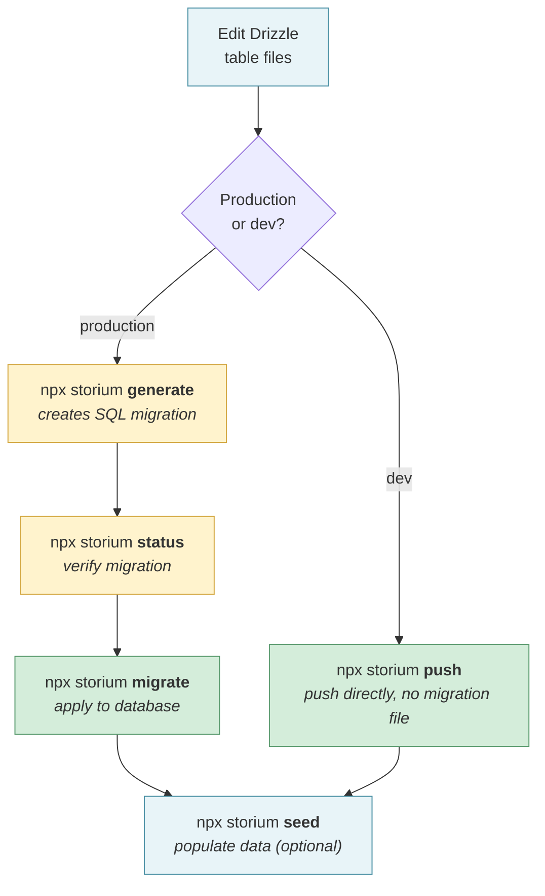
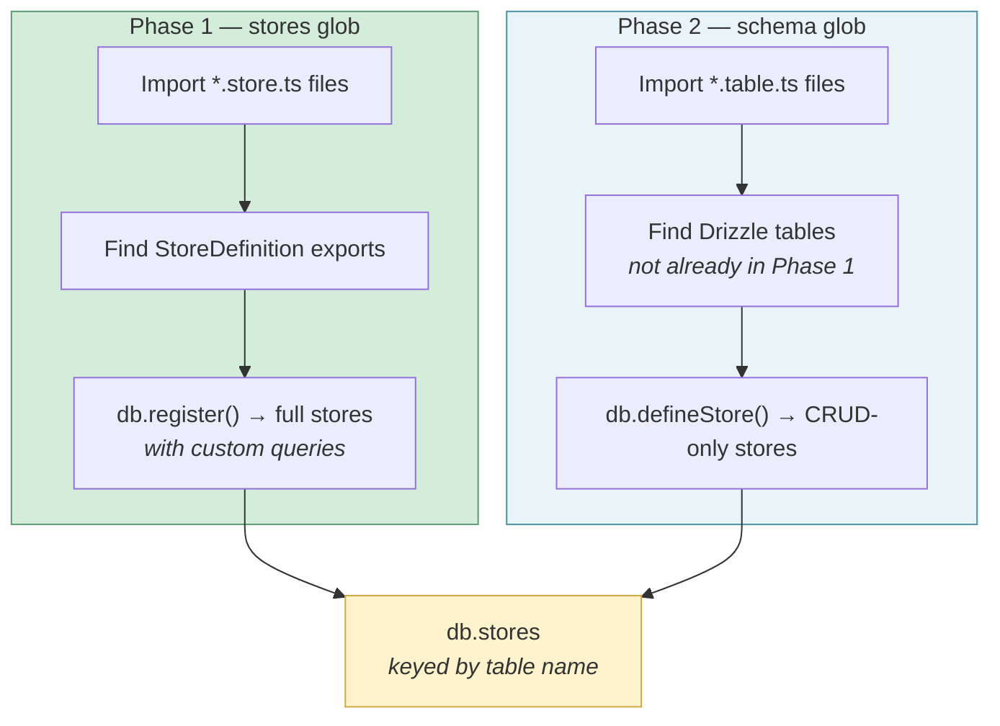

# Migrations

Storium wraps drizzle-kit for migration generation and drizzle-orm for migration execution. It adds seed file support on top. The same config file drives both tools.

## Config File

Storium looks for a config file in this order:

1. `STORIUM_CONFIG` environment variable
2. `DRIZZLE_CONFIG` environment variable
3. `storium.config.ts` in the working directory
4. `drizzle.config.ts` in the working directory

The file extensions `.ts`, `.js`, and `.mjs` are all probed. If you already have a `drizzle.config.ts`, storium uses it directly — no separate config needed.

```typescript
// storium.config.ts
import type { StoriumConfig } from 'storium'

export default {
  dialect: 'postgresql',
  dbCredentials: { url: process.env.DATABASE_URL! },
  schema: ['./entities/**/*.table.ts'],    // where Drizzle table exports live
  stores: ['./entities/**/*.store.ts'],    // where defineStore() exports live (storium-only)
  out: './migrations',                     // migration output directory
  seeds: './seeds',                        // seed files directory (storium-only)
} satisfies StoriumConfig
```

drizzle-kit reads `dialect`, `dbCredentials`, `schema`, and `out`. It silently ignores `stores` and `seeds`. Storium reads all of them.

### Config Keys

| Key | Used by | Description |
|-----|---------|-------------|
| `dialect` | Both | `'postgresql'`, `'mysql'`, `'sqlite'`, or `'memory'` |
| `dbCredentials` | Both | `{ url }` or `{ host, port, database, user, password }` |
| `url` | Storium | Shorthand for `dbCredentials.url` |
| `schema` | Both | Glob pattern(s) for table files (Drizzle table exports) |
| `stores` | Storium | Glob pattern(s) for store files (defineStore exports) — used by seed runner |
| `out` | Both | Directory for generated migration SQL files (default: `./migrations`) |
| `seeds` | Storium | Directory for seed files (default: `./seeds`) |
| `assertions` | Storium | Custom assertion functions for validation |
| `pool` | Storium | Connection pool options (`{ min, max }`) |

## Table Files

Table files export native Drizzle table definitions. drizzle-kit imports them at module level (before any DB connection exists), so they must be pure Drizzle — no storium runtime needed:

```typescript
// entities/users/user.table.ts
import { pgTable, uuid, varchar } from 'drizzle-orm/pg-core'

export const usersTable = pgTable('users', {
  id: uuid('id').primaryKey().defaultRandom(),
  email: varchar('email', { length: 255 }).notNull().unique(),
  name: varchar('name', { length: 255 }),
})
```

The table is a standard Drizzle table — drizzle-kit sees it as any other table definition. When wrapped with `defineStore()`, storium metadata is attached as a non-enumerable `.storium` property so it doesn't interfere with drizzle-kit.

## Store Files

Store files bundle a table with custom queries into a `StoreDefinition`:

```typescript
// entities/users/user.store.ts
import { defineStore } from 'storium'
import { usersTable } from './user.table'

export const userStore = defineStore(usersTable).queries({
  findByEmail: (ctx) => async (email) => ctx.findOne({ email }),
})
```

Store files are optional for migrations (drizzle-kit only needs schema files). They're used by the seed runner to auto-discover stores with their custom queries.

## CLI Commands

```bash
npx storium generate   # Diff schemas against last migration, create SQL file
npx storium migrate    # Apply pending migrations to the database
npx storium push       # Push schema directly to database (dev only, no migration file)
npx storium status     # List migration files and matched schema files
npx storium seed       # Run seed files in alphabetical order
```

These are convenience wrappers. `generate`, `push`, and `status` shell out to drizzle-kit. `migrate` uses drizzle-orm's built-in per-dialect migrators. `seed` is storium-only.

## Programmatic API

All commands are also available as async functions:

```typescript
import { storium } from 'storium'
import { generate, migrate, seed, status, loadConfig } from 'storium/migrate'

// generate and status don't need a DB connection
await generate()
const info = await status()

// migrate and seed need a live connection
const config = await loadConfig()
const db = storium.connect(config)
await migrate(db)
await seed(db)

await db.disconnect()
```

Each function returns `{ success: boolean, message: string }`. The `seed` function also returns `{ count: number }`.

## Lifecycle

A typical migration workflow:



## Seeds

Seed files live in the `seeds` directory (configurable via `seeds` in config). They're executed in alphabetical filename order, so use numbered prefixes:

```
seeds/
├── 001_users.ts
├── 002_posts.ts
└── 003_tags.ts
```

Each seed file exports a `defineSeed()` wrapper:

```typescript
// seeds/001_users.ts
import { defineSeed } from 'storium/migrate'

export default defineSeed(async (db) => {
  const { users, posts } = db.stores

  await users.create({ email: 'alice@example.com', name: 'Alice' })
  await users.create({ email: 'bob@example.com', name: 'Bob' })

  await posts.create({
    title: 'First Post',
    author_id: users.ref({ email: 'alice@example.com' }),
  })
})
```

### Seed Context

The `db` parameter passed to seed functions contains:

| Property | Description |
|----------|-------------|
| `db.stores` | Auto-discovered live stores, keyed by table name. |
| `db.drizzle` | Raw Drizzle instance. |
| `db.dialect` | Active dialect string. |
| `db.transaction` | Transaction helper. |
| `db.instance` | Full StoriumInstance for advanced use. |

### Store Discovery

The seed runner auto-discovers stores from your config:



1. **Phase 1** — Imports files matching the `stores` glob, finds `StoreDefinition` exports, and materializes them with `db.register()`. These stores have full custom queries.
2. **Phase 2** — Imports files matching the `schema` glob, finds storium-annotated tables and raw Drizzle tables not already covered by phase 1, and creates CRUD-only stores with `db.defineStore()`.

Phase 1 stores take priority by table name. This means if you have both `user.table.ts` (Drizzle table) and `user.store.ts` (StoreDefinition with custom queries), the seed runner uses the store version — giving your seeds access to custom queries like `findByEmail`.

### Seed Behavior

- Seeds run sequentially in filename order.
- If a seed fails, execution stops and the error is reported.
- Seeds are not idempotent by default — running them twice will create duplicate data unless you add your own checks.
- The seed runner does not track which seeds have been applied (unlike migrations). It runs all of them every time.

## Schema Collection

For advanced use cases, you can collect schemas programmatically:

```typescript
import { collectSchemas } from 'storium/migrate'

const schemas = await collectSchemas('./entities/**/*.table.ts')
// { users: <DrizzleTable>, posts: <DrizzleTable>, ... }
```

This imports files matching the glob, extracts `TableDef` and `StoreDefinition` exports, and returns a flat map of table names to Drizzle table objects.
