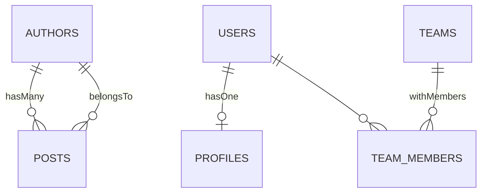
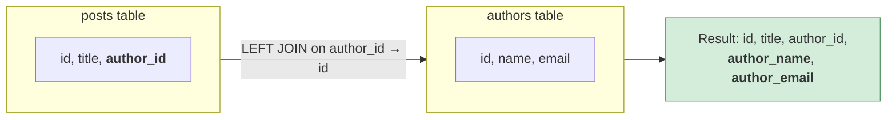
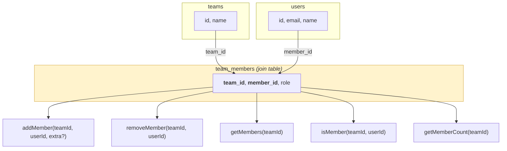

# Relationships

Storium provides composable mixins for common relationship patterns, plus full Drizzle access for anything more complex.

## Overview

| Pattern | Mixin | What it generates |
|---------|--------|-------------------|
| Belongs-to (many-to-one) | `belongsTo` | `findWith{Alias}(id)` — LEFT JOIN with inlined fields |
| Has-many (one-to-many) | `hasMany` | `find{Alias}For(id, opts?)` — flat array of related rows |
| Has-one (one-to-one) | `hasOne` | `find{Alias}For(id, opts?)` — single related row or null |
| Many-to-many | `withMembers` | `addMember`, `removeMember`, `getMembers`, `isMember`, `getMemberCount` |
| Anything else | Custom query | Full Drizzle query builder via `ctx.drizzle` |



Mixins are plain objects of query functions. Spread them into a store definition:

```typescript
import { defineStore, belongsTo, hasMany, withMembers } from 'storium'

const postStore = defineStore(postsTable).queries({
  ...belongsTo(authorsTable, 'author_id', { alias: 'author' }),
  ...withMembers(postTagsTable, 'post_id', 'tag_id'),
  // your own queries too:
  findByStatus: (ctx) => async (status) => ctx.find({ status }),
})

const authorStore = defineStore(authorsTable).queries({
  ...hasMany(postsTable, 'author_id', { alias: 'posts' }),
})
```

## belongsTo

Generates a `findWith{Alias}` method that LEFT JOINs a related table and returns the entity with related fields inlined under a prefix.



### API

```typescript
belongsTo(relatedTableDef, foreignKey, options)
```

| Parameter | Type | Description |
|-----------|------|-------------|
| `relatedTable` | Drizzle table | The related table (must have `.storium` metadata via `defineStore`). |
| `foreignKey` | `string` | Column on the current table that references the related table's PK. |
| `options.alias` | `string` | Name for the relationship. Determines method name and field prefix. |
| `options.select` | `string[]` (optional) | Which columns to include from the related table. Defaults to all selectable. |

### Example

```typescript
const postStore = defineStore(postsTable).queries({
  ...belongsTo(authorsTable, 'author_id', {
    alias: 'author',
    select: ['name', 'email'],
  }),
})

const { posts } = db.register({ posts: postStore })
const post = await posts.findWithAuthor(postId)
// {
//   id: '...', title: '...', author_id: '...',
//   author_name: 'Alice',
//   author_email: 'alice@example.com'
// }
```

### Behavior

- Uses a **LEFT JOIN**, so the entity is returned even if the related row doesn't exist (related fields will be `null`).
- Related fields are prefixed with `{alias}_` (e.g., `author_name`, `author_email`).
- The method name is `findWith` + capitalized alias: `'author'` → `findWithAuthor`.
- The related table's primary key is detected automatically from its `.storium` metadata.
- Returns `null` if the entity itself doesn't exist.

## hasMany

Generates a `find{Alias}For` method that returns all related rows for a given parent entity ID.

### API

```typescript
hasMany(relatedTableDef, foreignKey, options)
```

| Parameter | Type | Description |
|-----------|------|-------------|
| `relatedTable` | Drizzle table | The related table (must have `.storium` metadata via `defineStore`). |
| `foreignKey` | `string` | Column on the related table referencing the parent entity's PK. |
| `options.alias` | `string` | Name for the relationship. Determines method name: `find{Alias}For`. |
| `options.select` | `string[]` (optional) | Which columns to include from the related table. Defaults to all selectable. |

### Example

```typescript
const authorStore = defineStore(authorsTable).queries({
  ...hasMany(postsTable, 'author_id', { alias: 'posts' }),
})

const { authors } = db.register({ authors: authorStore })
const posts = await authors.findPostsFor(authorId)
// [{ id, title, author_id, createdAt, ... }, ...]
```

### Behavior

- Returns a **flat array** of related rows (empty array if none found).
- The method name is `find` + capitalized alias + `For`: `'posts'` → `findPostsFor`.
- Supports standard query opts: `limit`, `offset`, `orderBy`, and `where` callback.

```typescript
// With opts
await authors.findPostsFor(authorId, {
  limit: 10,
  orderBy: { column: 'createdAt', direction: 'desc' },
  where: (t) => eq(t.status, 'published'),
})
```

## hasOne

Generates a `find{Alias}For` method that returns a single related row or `null` for a given parent entity ID.

### API

```typescript
hasOne(relatedTableDef, foreignKey, options)
```

| Parameter | Type | Description |
|-----------|------|-------------|
| `relatedTable` | Drizzle table | The related table (must have `.storium` metadata via `defineStore`). |
| `foreignKey` | `string` | Column on the related table referencing the parent entity's PK. |
| `options.alias` | `string` | Name for the relationship. Determines method name: `find{Alias}For`. |
| `options.select` | `string[]` (optional) | Which columns to include from the related table. Defaults to all selectable. |

### Example

```typescript
const userStore = defineStore(usersTable).queries({
  ...hasOne(profilesTable, 'user_id', { alias: 'profile' }),
})

const { users } = db.register({ users: userStore })
const profile = await users.findProfileFor(userId)
// { id, user_id, bio, avatar, ... } | null
```

### Behavior

- Returns a **single row** or `null` if not found.
- The method name is `find` + capitalized alias + `For`: `'profile'` → `findProfileFor`.
- Internally uses `LIMIT 1` — if multiple rows exist, only the first is returned.
- Supports the `where` callback opt for additional filtering.

## withMembers

Generates five methods for managing many-to-many relationships through a join table.



### API

```typescript
withMembers(joinTableDef, foreignKey, memberKey?)
```

| Parameter | Type | Description |
|-----------|------|-------------|
| `joinTable` | Drizzle table | The join/membership table (must have `.storium` metadata via `defineStore`). |
| `foreignKey` | `string` | Column on the join table referencing the "collection" (e.g., `team_id`). |
| `memberKey` | `string` (optional) | Column on the join table referencing the "member". Default: `'member_id'`. |

### Generated Methods

| Method | Signature | Description |
|--------|-----------|-------------|
| `addMember` | `(collectionId, memberId, extra?)` | Insert a join record. `extra` is for additional fields (e.g., `{ role: 'admin' }`). |
| `removeMember` | `(collectionId, memberId)` | Delete the join record. |
| `getMembers` | `(collectionId)` | Return all join records for a collection. |
| `isMember` | `(collectionId, memberId)` | Check membership (returns boolean). |
| `getMemberCount` | `(collectionId)` | Count members in a collection. |

### Example

```typescript
const teamStore = defineStore(teamsTable).queries({
  ...withMembers(teamMembersTable, 'team_id'),
})

const { teams } = db.register({ teams: teamStore })

await teams.addMember(teamId, userId, { role: 'captain' })
await teams.isMember(teamId, userId)       // true
await teams.getMemberCount(teamId)          // 1
await teams.getMembers(teamId)             // [{ team_id, user_id, role, ... }]
await teams.removeMember(teamId, userId)
```

### Customizing the Member Key

The default `memberKey` is `'user_id'`. Override it when your join table uses a different column name:

```typescript
// posts ↔ tags via post_tags (post_id, tag_id)
const postStore = defineStore(postsTable).queries({
  ...withMembers(postTagsTable, 'post_id', 'tag_id'),
})
```

### Join Table with Composite Primary Key

Join tables are best modeled with a composite primary key — no synthetic `id` column needed:

```typescript
import { sqliteTable, text, primaryKey } from 'drizzle-orm/sqlite-core'

const postTagsTable = sqliteTable('post_tags', {
  postId: text('post_id').notNull(),
  tagId: text('tag_id').notNull(),
}, (table) => [
  primaryKey({ columns: [table.postId, table.tagId] }),
])
```

CRUD methods accept an array of values matching the PK column order:

```typescript
const postTags = db.defineStore(postTagsTable)

await postTags.findById([postId, tagId])
await postTags.destroy([postId, tagId])
```

Note: `findByIdIn()` is not supported on composite PK tables — use `find()` with filters instead.

## FK Resolution with `ref()`

When creating records with foreign keys, use `ref()` to look up the related row's primary key by a filter — no manual ID tracking needed:

```typescript
await posts.create({
  title: 'Hello World',
  author_id: authors.ref({ email: 'alice@example.com' }),
})
```

`ref()` returns a Promise, but you don't need to `await` it — the prep pipeline's Stage 0 resolves Promises in input values automatically before validation.

`ref()` throws a `StoreError` if no matching row is found.

## Custom JOIN Queries

For relationships the mixins don't cover, use `ctx.drizzle` to write raw Drizzle JOINs:

```typescript
import { eq } from 'drizzle-orm'

const tagStore = defineStore(tagsTable).queries({
  // Three-way JOIN: tags → post_tags → posts
  findPostsByTag: (ctx) => async (tagName: string) =>
    ctx.drizzle
      .select({
        id: postsTable.id,
        title: postsTable.title,
        status: postsTable.status,
      })
      .from(tagsTable)
      .innerJoin(postTagsTable, eq(postTagsTable.tag_id, tagsTable.id))
      .innerJoin(postsTable, eq(postsTable.id, postTagsTable.post_id))
      .where(eq(tagsTable.name, tagName)),
})
```

Common cases that need custom JOINs:

- Reverse lookups (find all posts for a given tag name)
- JOINs across more than two tables
- Aggregate queries (count posts per author)
- JOINs with complex WHERE conditions
- Self-referential relationships (e.g., parent/child categories)

## Combining Mixins

Mixins compose naturally via spread. A single store can use multiple mixins:

```typescript
const postStore = defineStore(postsTable).queries({
  // Belongs-to: posts → authors
  ...belongsTo(authorsTable, 'author_id', {
    alias: 'author',
    select: ['name', 'email'],
  }),
  // Many-to-many: posts ↔ tags
  ...withMembers(postTagsTable, 'post_id', 'tag_id'),
  // Your own queries
  findPublished: (ctx) => async () => ctx.find({ status: 'published' }),
})

const authorStore = defineStore(authorsTable).queries({
  // One-to-many: authors → posts
  ...hasMany(postsTable, 'author_id', { alias: 'posts' }),
  // One-to-one: authors → profiles
  ...hasOne(profilesTable, 'user_id', { alias: 'profile' }),
})
```
